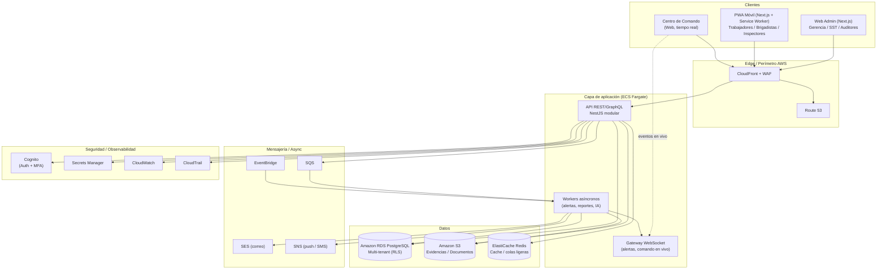
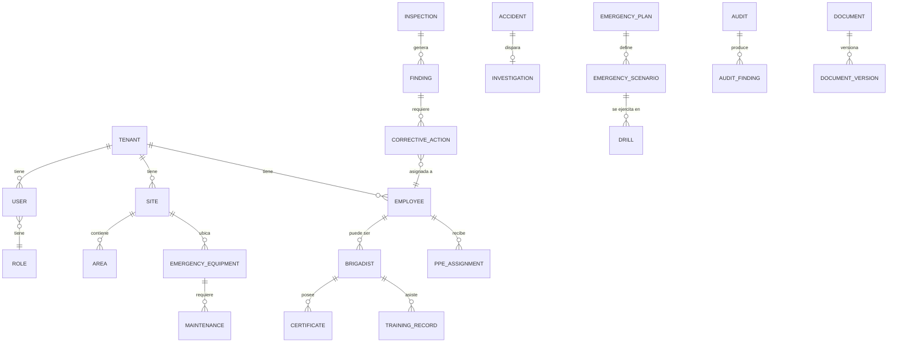
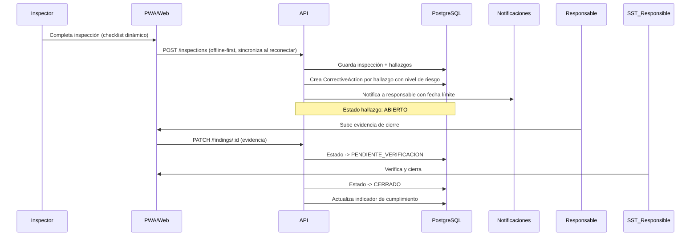

# ARQUITECTURA MAESTRA — SEGURIDAD 360 COLOMBIA

> Plataforma SaaS multi-tenant para gestión integral de SG-SST, brigadas de
> emergencia, gestión del riesgo, inspecciones, capacitación, accidentalidad,
> contratistas, auditorías y cumplimiento normativo colombiano.
>
> Este documento es la **Fase 1 — Arquitectura** del proyecto. Define el
> sistema antes de escribir código de negocio. Las fases siguientes
> (UX/UI, base de datos, backend, frontend, PWA, IA, AWS, testing, deploy)
> se construyen sobre lo aquí definido y se ejecutan de forma incremental,
> confirmando alcance con el equipo de producto antes de cada fase mayor.

---

## 1. Resumen ejecutivo

Seguridad 360 Colombia conecta en un solo ecosistema los procesos de
Seguridad y Salud en el Trabajo, gestión del riesgo de desastres y respuesta
a emergencias, para que la información fluya entre módulos en vez de vivir
en formularios aislados. El principio rector es que **cada evento genera el
siguiente**: una inspección genera hallazgos, un hallazgo genera una acción
correctiva con responsable y fecha límite, su cierre alimenta un indicador,
y los indicadores alimentan el dashboard gerencial y el motor de alertas.

La plataforma es **SaaS multi-tenant real** (aislamiento estricto entre
empresas), con roles configurables (RBAC), trazabilidad total (audit log),
y una superficie de tres clientes: **web administrativa**, **PWA
móvil/offline** para trabajadores y brigadistas, y un **Centro de Comando**
para emergencias en tiempo real.

No es una herramienta que "certifica cumplimiento legal": es una
herramienta de gestión que documenta evidencias contra criterios
configurables, dejando la interpretación legal a un profesional autorizado
(ver `SECURITY.md` §Cumplimiento normativo).

---

## 2. Arquitectura general (diagrama de componentes)



**Decisión clave — Monolito modular vs. microservicios**

- **Opción A — Monolito modular (NestJS, módulos por dominio).**
  Un solo servicio desplegado en ECS/Fargate con módulos internos
  fuertemente separados (`inspections`, `brigade`, `training`, `emergency`,
  etc.), cada uno con sus propios controladores, servicios y repositorios.
- **Opción B — Microservicios por dominio** desde el día uno.
- **Recomendación:** Opción A para el MVP y los primeros 1-2 años de
  crecimiento. Un monolito modular bien separado permite extraer
  microservicios después (p. ej. IA o notificaciones) sin reescribir nada,
  y evita el costo operativo de orquestar decenas de servicios cuando aún
  no hay tráfico que lo justifique.
  **Impacto en costo:** mucho menor (un solo cluster ECS, una sola RDS).
  **Impacto en escalabilidad:** suficiente hasta miles de tenants activos
  gracias a autoscaling horizontal de tareas Fargate + réplicas de lectura
  en RDS; se revisita si un módulo (p. ej. IA de imágenes) necesita
  aislarse por carga o por costo de GPU.

---

## 3. Stack tecnológico

| Capa | Tecnología | Motivo |
|---|---|---|
| Frontend web | Next.js 14 (App Router) + TypeScript + Tailwind CSS | SSR/SEO para dashboard, buen soporte de formularios complejos, ecosistema maduro |
| Componentes UI | shadcn/ui + Radix + Recharts/Visx para gráficas | Accesibilidad, consistencia visual, theming por tenant |
| PWA móvil | Next.js compartiendo `packages/ui`, Service Worker + IndexedDB (Dexie) | Reutiliza stack, soporta offline-first (inspecciones, reportes) |
| Backend | NestJS (Node.js + TypeScript) | Arquitectura modular por diseño (módulos/DI), RBAC, guards, interceptors, encaja con monolito modular |
| API | REST versionado (`/api/v1`) documentado con OpenAPI/Swagger; WebSocket (Socket.IO) para Centro de Comando | REST es suficiente para CRUD intensivo; WS solo donde hay tiempo real |
| ORM / DB | PostgreSQL + Prisma (o TypeORM) | Tipado fuerte, migraciones versionadas, soporta Row-Level Security de Postgres para aislamiento multi-tenant |
| Autenticación | Amazon Cognito (User Pools) + JWT + MFA | Evita reinventar gestión de credenciales, soporta SSO futuro, MFA nativo |
| Almacenamiento de archivos | Amazon S3 (buckets por ambiente, prefijo por tenant) + CloudFront firmado | Evidencias, fotos, documentos, certificados |
| Cola / eventos | Amazon SQS + EventBridge | Desacopla alertas, generación de reportes, análisis de IA |
| Cache | ElastiCache Redis (opcional en MVP, necesario a partir de cientos de tenants) | Sesiones, rate limiting, resultados de dashboard |
| IA | Servicio propio en `packages`/módulo `ai` que llama modelos vía API (Claude) para clasificación de fotos y asistente SST | Se aísla detrás de una interfaz para poder cambiar de proveedor sin tocar el resto del sistema |
| Infraestructura | AWS ECS Fargate, RDS, S3, CloudFront, WAF, Route 53, Secrets Manager, CloudWatch, CloudTrail, SES, SNS | Ver §7 |
| IaC | Terraform | Reproducible, revisable en PR, evita "clicks" manuales en consola |
| CI/CD | GitHub Actions → build/test/lint → ECR → ECS | Integra con el repositorio, gates de calidad antes de deploy |

**Decisión clave — REST vs. GraphQL**
- **Opción A — REST versionado.** Predecible, cacheable, fácil de documentar con Swagger, encaja bien con permisos por endpoint (RBAC).
- **Opción B — GraphQL.** Mejor para dashboards con formas de datos muy variables.
- **Recomendación:** REST para el núcleo transaccional (mismo patrón en
  los ~30 módulos), reservando GraphQL o vistas agregadas (`/dashboard/*`)
  solo si en el futuro el frontend necesita componer datos de muchos
  módulos en una sola pantalla de forma muy dinámica. Empezar con REST
  reduce complejidad y acelera el MVP sin cerrar la puerta a agregar un
  gateway GraphQL después.

---

## 4. Estructura del proyecto (monorepo)

```
seguridad-360-colombia/
├── apps/
│   ├── web/                 # Next.js — app administrativa (dashboard, gestión)
│   ├── mobile-pwa/          # Next.js PWA — trabajadores, brigadistas, inspectores
│   └── api/                 # NestJS — API REST + WebSocket Gateway
│       └── src/
│           ├── modules/
│           │   ├── auth/
│           │   ├── tenants/
│           │   ├── users/
│           │   ├── employees/
│           │   ├── contractors/
│           │   ├── brigade/
│           │   ├── training/
│           │   ├── inspections/
│           │   ├── findings/
│           │   ├── risk-matrix/
│           │   ├── accidents/
│           │   ├── investigations/
│           │   ├── ppe/
│           │   ├── emergency-equipment/
│           │   ├── maintenance/
│           │   ├── emergency-plan/
│           │   ├── drills/
│           │   ├── command-center/
│           │   ├── work-permits/
│           │   ├── copasst/
│           │   ├── audits/
│           │   ├── action-plans/
│           │   ├── documents/
│           │   ├── signatures/
│           │   ├── notifications/
│           │   ├── indicators/
│           │   ├── reports/
│           │   ├── ai/
│           │   ├── qr/
│           │   └── audit-log/
│           ├── common/          # guards, interceptors, decorators, RBAC
│           └── main.ts
├── packages/
│   ├── shared-types/         # DTOs / tipos compartidos entre apps
│   └── ui/                   # Componentes UI compartidos (design system)
├── infra/
│   ├── terraform/            # IaC de AWS (VPC, ECS, RDS, S3, Cognito, etc.)
│   └── docker/                # Dockerfiles y docker-compose para desarrollo local
├── docs/
│   ├── ARCHITECTURE.md        # Este documento
│   ├── DATABASE.md
│   ├── API.md
│   ├── SECURITY.md
│   └── DEPLOYMENT.md
├── .github/workflows/         # CI/CD
└── README.md
```

Cada carpeta bajo `apps/api/src/modules` corresponde a un dominio de
negocio con su propio controlador, servicio, repositorio, DTOs y tests —
así un módulo se puede extraer a un microservicio independiente más
adelante sin reescribir lógica de negocio.

---

## 5. Modelo de datos (visión general)

Ver `docs/DATABASE.md` para el modelo completo. Todas las tablas de
negocio incluyen `tenant_id` con Row-Level Security de PostgreSQL, de modo
que el aislamiento no depende solo de la lógica de aplicación.



---

## 6. Roles y permisos (RBAC)

Roles base (ver detalle de permisos por acción en `SECURITY.md`):

`SUPER_ADMIN`, `COMPANY_ADMIN`, `MANAGER`, `SST_RESPONSIBLE`,
`SST_COORDINATOR`, `SUPERVISOR`, `INSPECTOR`, `BRIGADIST`, `WORKER`,
`CONTRACTOR`, `AUDITOR`, `MEDICAL_PROFESSIONAL`, `READONLY`.

Cada rol tiene permisos granulares por módulo: `view`, `create`, `edit`,
`delete`, `approve`, `sign`, `download`, `audit`, `export`. Los roles
personalizados se modelan como conjuntos de permisos configurables por
tenant, nunca hardcodeados en el código de un módulo — el guard de
autorización consulta permisos, no nombres de rol.

**Aislamiento multi-tenant:** todo `access token` lleva `tenant_id` y
`role`; un `TenantGuard` global valida que cada consulta a base de datos
esté acotada a ese tenant (RLS de Postgres como segunda barrera, no la
única). Ningún endpoint puede recibir un `tenant_id` distinto por
parámetro salvo `SUPER_ADMIN` en el panel de super administración.

---

## 7. Seguridad y AWS

Ver `docs/SECURITY.md` para el detalle de controles (MFA, cifrado,
protección de datos personales, cumplimiento normativo colombiano).

Servicios AWS utilizados y su propósito — **solo los necesarios**, sin
sobre-ingeniería:

| Servicio | Uso | ¿Por qué sí? |
|---|---|---|
| ECS Fargate | Ejecuta API y workers | Sin gestión de servidores, autoscaling simple |
| RDS PostgreSQL (Multi-AZ) | Base de datos transaccional | Durabilidad, réplicas de lectura para dashboards |
| S3 | Documentos, evidencias, fotos | Durable, barato, integra con CloudFront firmado |
| CloudFront + WAF | CDN + protección perimetral | Cachea frontend, bloquea ataques comunes (OWASP) |
| Route 53 | DNS | Dominio propio, salud de endpoints |
| Cognito | Autenticación, MFA | Evita construir gestión de contraseñas propia |
| Secrets Manager | Credenciales de DB, API keys | Rotación, nunca secretos en código |
| CloudWatch | Logs, métricas, alarmas | Observabilidad operativa |
| CloudTrail | Auditoría de la infraestructura AWS | Requisito de trazabilidad, forense |
| SES | Correo transaccional | Alertas de vencimiento, notificaciones |
| SNS | Push / SMS | Botón de emergencia, alertas críticas |
| SQS + EventBridge | Colas y eventos | Desacopla generación de reportes, IA, alertas masivas |
| Lambda | Tareas puntuales (p. ej. generación de PDF bajo demanda, thumbnails) | Solo donde una función corta no justifica un contenedor siempre activo |

Explícitamente **no** se usa (para el MVP): microservicios por dominio,
Kubernetes/EKS, multi-región activa-activa, ni un data lake — se
introducen solo si el crecimiento real de tenants/datos lo justifica.

---

## 8. Flujos principales

**Inspección → cierre de hallazgo**



**Brigadista → competencia**

```
BRIGADISTA → CAPACITACIÓN → CERTIFICACIÓN → VENCIMIENTO
   → ALERTA (30/7 días) → REENTRENAMIENTO → SIMULACRO → EVALUACIÓN
   → Semáforo de competencia (🟢🟡🔴) recalculado automáticamente
```

Estos flujos se implementan con un **motor de workflow genérico**
(`WorkflowState`, `WorkflowTransition`) reutilizable en inspecciones,
accidentes, auditorías, acciones y permisos de trabajo (ver §57 del
prompt original), en vez de estados hardcodeados por módulo.

---

## 9. Roadmap por fases

1. **Fase 1 — Arquitectura** ✅ (este documento + estructura de carpetas)
2. **Fase 2 — UX/UI**: wireframes de dashboard, inspección, carné de
   brigadista, pasaporte de seguridad, centro de comando, app móvil.
3. **Fase 3 — Base de datos**: schema Prisma completo, migraciones,
   índices, seed de la empresa demo.
4. **Fase 4 — Backend**: auth + RBAC + módulos núcleo del MVP (ver §10).
5. **Fase 5 — Frontend web**: dashboard, tablas, formularios, gráficas.
6. **Fase 6 — PWA**: login, reporte de peligro, inspecciones offline,
   carné/QR, botón de emergencia.
7. **Fase 7 — IA**: interfaz de servicio de IA (clasificación de fotos,
   asistente SST) con proveedor conectable.
8. **Fase 8 — AWS**: Terraform de la infraestructura descrita en §7.
9. **Fase 9 — Testing**: unit, integración, E2E, pruebas de seguridad.
10. **Fase 10 — Deploy**: Docker, CI/CD, dominio, HTTPS, variables de entorno.

Cada fase se entrega de forma incremental y se marca **FASE COMPLETADA**
antes de iniciar la siguiente, permitiendo validar alcance y ajustar
prioridades con el equipo de producto.

---

## 10. MVP (alcance mínimo viable)

Para llegar a una primera versión usable sin comprometer arquitectura:

- Autenticación + Cognito + RBAC + multi-tenant (aislamiento real).
- Módulos: Empresas/Sedes/Áreas, Trabajadores, Brigada (hoja de vida +
  formación + semáforo), Inspecciones (con constructor de formularios
  básico), Hallazgos + Acciones Correctivas, Capacitaciones (LMS básico),
  Documentos (S3 + versionamiento), Notificaciones (email + push),
  Indicadores + Dashboard, Auditoría del sistema (audit log).
- PWA: login, reporte de condición insegura con foto, inspección offline
  con sincronización, carné digital con QR.
- Centro de Comando en versión simple (estado de sedes, alertas activas).
- Infraestructura: ECS + RDS + S3 + Cognito + CloudFront + WAF + SES,
  desplegada con Terraform, con CI/CD básico.

Quedan para después del MVP (fases posteriores, no descartadas):
matriz de peligros completa con mapa de calor, simulacros con evaluación
detallada, gestión de contratistas con portal propio, permisos de
trabajo con verificación automática de requisitos, COPASST, mapa
interactivo de sedes, IA de análisis de fotos y asistente conversacional,
y el modelo de planes/suscripciones (Stripe/Wompi).

---

## 11. Próximos pasos

Con esta arquitectura aprobada, la Fase 2 (UX/UI) y Fase 3 (base de
datos) pueden avanzar en paralelo. Se recomienda confirmar el alcance del
MVP de la sección 10 antes de empezar a escribir código de los módulos,
para evitar construir funcionalidad que luego se deba rehacer.
